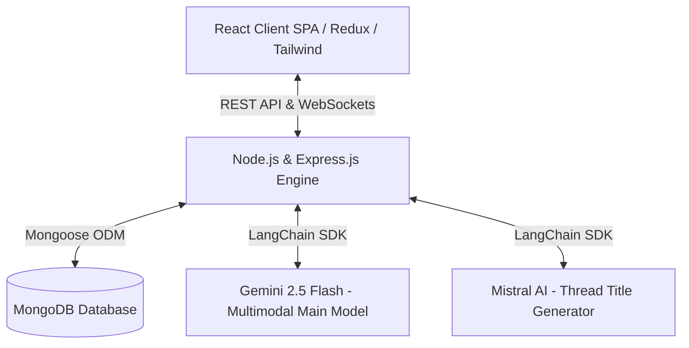

# 🌌 Perplexity AI Clone (Glassmorphic Intelligence Search Engine)

[](LICENSE)
[](https://nodejs.org)
[](https://vitejs.dev)
[](https://redux-toolkit.js.org/)
[](https://deepmind.google/technologies/gemini/)

A premium, high-performance conversational AI search engine designed to replicate the Perplexity.ai experience. Featuring state-of-the-art **multimodal inputs**, **real-time reactive loaders**, **instant client-side canvas compression**, and **GitHub Flavored Markdown (GFM) parsed tables** wrapped inside a sleek glassmorphic dark interface.

---

## 🏗️ System Architecture

This project is built using a modern decoupled architecture designed for speed, low latency, and high scalability:



### Technical Highlights
* **Agentic Chat Title summarized by Mistral AI**: New conversations are routed through a dedicated LangChain prompt pipeline utilizing Mistral Small to summarize the prompt into a concise 3-5 word title, keeping primary sessions focused.
* **Multimodal Visual Reasoning with Gemini 2.5 Flash**: Users can upload complex schematics, mathematical layouts, photos, or diagrams and get visual explanations natively.
* **Stateful HTTP-Only JWT Cookie Middleware**: Conversation histories are protected under private routes containing custom cookie signature verification checks.

---

## 📁 Project Structure

Below is an overview of the directory tree mapping out the client and server codebases:

```text
perplexity/
├── Backend/
│   ├── src/
│   │   ├── config/          # Database connect configs
│   │   ├── controllers/     # Route controller logic (chat, auth)
│   │   ├── middlewares/     # JWT authentication middlewares
│   │   ├── models/          # Mongoose DB schemas (user, chat, message)
│   │   ├── routes/          # Express route routers
│   │   ├── services/        # LangChain AI orchestrations
│   │   └── sockets/         # Socket.io connection handlers
│   ├── server.js            # Node HTTP server entry point
│   ├── package.json         # Backend dependencies
│   └── .env                 # Backend private environment variables
│
├── Frontend/
│   ├── src/
│   │   ├── app/             # Redux Store configurator
│   │   ├── features/
│   │   │   ├── auth/        # Auth hooks, states, and landing pages
│   │   │   └── chat/
│   │   │       ├── components/ # ChatInput, Sidebar, Conversation threads
│   │   │       ├── hooks/      # useChat central custom react hooks
│   │   │       ├── pages/      # Dashboard main pages
│   │   │       ├── service/    # Socket & Axios REST API utilities
│   │   │       └── chat.slice  # Redux Toolkit chat slices
│   │   ├── main.jsx         # App mounting entry point
│   │   └── App.css          # Main global design styles
│   ├── package.json         # Frontend dependencies
│   └── vite.config.js       # Vite bundler configurations
│
└── README.md                # System documentation
```

---

## ⚡ Key Core Features

### 1. Instant Client-Side Image Compression & Downscaling
* Traditional multipart file uploads slow down chats and inflate server/cloud storage costs.
* **The Solution**: In [ChatInput.jsx](file:///c:/Users/Tarun%20Rajput/Desktop/perplexity/Frontend/src/features/chat/components/ChatInput.jsx), images are loaded into an offscreen HTML5 `<canvas>` on selection. 
* **The Compression**: The canvas scales down images exceeding a boundary of `1024px` and compiles them as compressed JPEG base64 data URLs with `70%` quality. 
* **Impact**: A high-resolution `5MB` phone camera capture shrinks down to a lightweight `~100KB` in milliseconds, offering near-instant uploads that easily fit inside MongoDB's 16MB document boundaries.

### 2. Github Flavored Markdown (GFM) Table Support
* Harnesses the power of **`ReactMarkdown`** supercharged by **`remark-gfm`** to parse complex tables, nested listings, tasklists, and code sections returned by Gemini.
* Customized CSS component overrides in [ConversationView.jsx](file:///c:/Users/Tarun%20Rajput/Desktop/perplexity/Frontend/src/features/chat/components/ConversationView.jsx) render tables inside styled glassmorphic panels featuring dividing lines (`divide-[#2B2E2E]`), alternating headers, row hovers (`hover:bg-[#1C1F1F]/40`), and fully responsive horizontal scroll capabilities.

### 3. Integrated Reactive Loaders (UX/UI Feedback)
* **Canvas Compression Wheel**: A flashing dashed preview box appears inside the upload list with a `"Shrinking"` indicator to represent active client-side downscaling.
* **Active Send Spinner**: The standard submit arrow changes into a spinning `Loader2` wheel when communication is active.
* **Optimistic "Sending..." Badge**: Renders user text and image thumbnails immediately on screen, labeled with a custom pulsing badge indicating active transfer to ensure zero cognitive latency.

---

## 🌐 API Endpoint Specifications

All endpoints under `/api/chats` require valid credentials set via HTTP-only cookie tokens.

| Method | Endpoint | Description | Payload Schema | Response Schema |
| :--- | :--- | :--- | :--- | :--- |
| **POST** | `/api/auth/register` | Register a new user | `{ username, email, password }` | `{ success: true, user }` |
| **POST** | `/api/auth/login` | Login user (sets HTTP Cookie) | `{ email, password }` | `{ success: true, token }` |
| **GET** | `/api/chats/` | Retrieve user chat threads | *None* | `{ message, chats: [...] }` |
| **GET** | `/api/chats/:chatId/messages` | Retrieve thread messages | *None* | `{ message, message: [...] }` |
| **POST** | `/api/chats/message` | Submit query (multimodal) | `{ message, chat, images }` | `{ title, chat, userMessage, aiMessage }` |
| **DELETE** | `/api/chats/delete/:chatId` | Delete an entire chat thread | *None* | `{ message: "chat deleted..." }` |

---

## 🚀 Installation & Detailed Setup Guide

### 📋 Prerequisites
Ensure you have the following installed on your machine:
* [Node.js](https://nodejs.org) (v18.0.0 or higher recommended)
* [MongoDB](https://www.mongodb.com) (Local Community Server or MongoDB Atlas account)
* API Key credentials for Google Gemini and Mistral AI.

---

### Step-by-Step Installation

#### 1. Clone the Repository
```bash
git clone https://github.com/Tarun8817/PerplexityClone.git
cd PerplexityClone
```

#### 2. Set Up the Backend Environment Variables
Create a file named `.env` in the `Backend/` directory:
```bash
cd Backend
touch .env
```
Populate `Backend/.env` with the following configuration:
```env
# Server Network Configurations
PORT=3000

# Database Persistence
# Use "mongodb://localhost:27017/perplexity" for local MongoDB installation
MONGODB_URI=your_mongodb_connection_string

# Stateful Authentication Secret
JWT_SECRET=your_jwt_signature_secret_phrase

# Large Language Model API Credentials
# Get key here: https://aistudio.google.com/
GEMINI_API_KEY=your_google_gemini_api_key

# Get key here: https://console.mistral.ai/
MISTRAL_API_KEY=your_mistral_api_key
```

#### 3. Run the Backend Server
Install backend dependencies and run in development mode backed by Nodemon:
```bash
npm install
npm run dev
```
*The server will boot successfully and listen on port `3000`. You will see `MongoDB Connected Successfully` in the logs.*

#### 4. Run the React Client
Open a new terminal window, navigate to the frontend folder, install packages, and start the Vite dev server:
```bash
cd ../Frontend
npm install
npm run dev
```
*Vite will compile assets and serve the UI at `http://localhost:5173`. Open this URL in your web browser to start exploring!*

#### 5. Compile Production Bundle
To build the application for deployment:
```bash
npm run build
```
*Vite will compile and compress modules, outputting optimized client production assets into `Frontend/dist/`.*

---

## 💡 Manual Testing & Validation Scenarios

Once both servers are running:
1. **Sign Up & Log In**: Go to the login screen, register a test account, and authenticate. Confirm cookies are saved in browser tools.
2. **Text Messaging**: Initiate a conversation thread (e.g. *"Explain quantum computing"*). Verify the socket streams the response, and Mistral summaries generate a concise title in the left sidebar directory.
3. **Image Attachment**:
   * Click the capsule **"Upload Images"** button. Select 1 or more images.
   * Watch the flashing **"Shrinking"** animation downscale the base64 output.
   * Type a question (e.g., *"What is in this diagram?"*), click send, and check the optimistic **"Sending" badge** overlay.
   * Confirm Gemini analyzes the visual inputs perfectly.
4. **Table Verification**: Ask Gemini to *"Compare React, Angular, and Vue in a markdown table."* Verify that the responsive glassmorphic GFM table displays beautifully with elegant alternate header styles.
