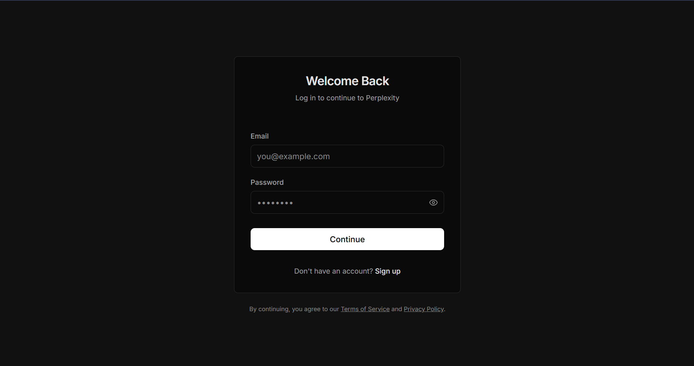
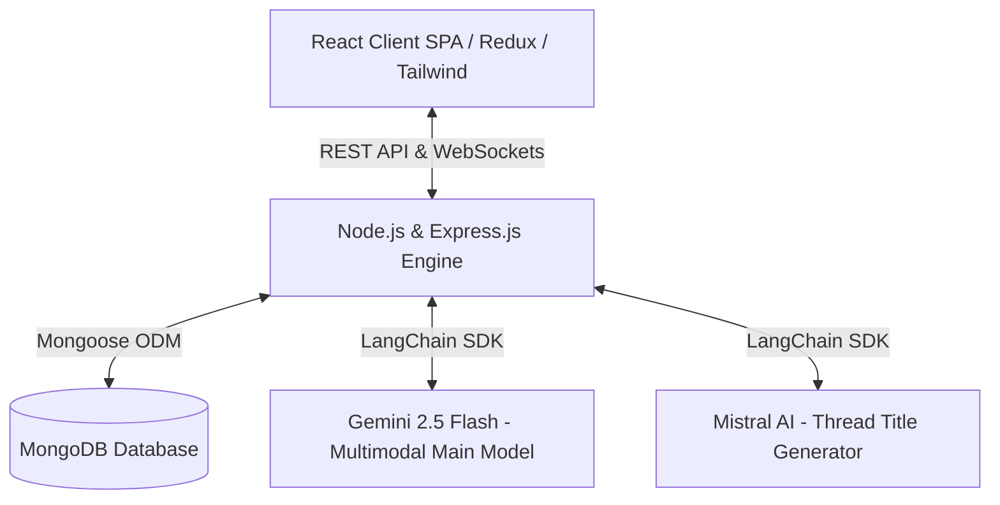

# 🌌 Perplexity AI Clone (Glassmorphic Intelligence Search Engine)

[](LICENSE)
[](https://nodejs.org)
[](https://react.dev)
[](https://vitejs.dev)
[](https://tailwindcss.com)
[](https://www.mongodb.com/)
[](https://redux-toolkit.js.org/)
[](https://deepmind.google/technologies/gemini/)

A premium, high-performance conversational AI search engine designed to replicate the Perplexity.ai experience. Featuring state-of-the-art **multimodal inputs**, **real-time reactive loaders**, **instant client-side canvas compression**, and **GitHub Flavored Markdown (GFM) parsed tables** wrapped inside a sleek glassmorphic dark interface.

## 📸 Screenshots




---

## 🛠️ Tech Stack & Libraries Used

This project utilizes a modern MERN stack combined with cutting-edge AI integrations and UI libraries:

**Frontend (React/Vite):**
- **React.js** with **Vite** for lightning-fast HMR and building
- **Tailwind CSS** for modern, utility-first glassmorphic styling
- **Redux Toolkit** for predictable state management across the app
- **React Router Dom** for client-side routing
- **React-Hot-Toast** for beautiful, non-intrusive notification popups
- **Lucide React** for clean and consistent iconography
- **React Markdown** & **Remark GFM** for parsing AI markdown tables and code blocks

**Backend (Node.js/Express):**
- **Node.js & Express.js** for a robust RESTful API
- **MongoDB & Mongoose** for flexible document-based data persistence
- **Socket.io** for real-time bidirectional event streaming
- **JSON Web Tokens (JWT) & bcrypt** for secure, HTTP-only cookie authentication
- **Nodemailer** for automated email verification dispatching

**AI & LLMs:**
- **Google Gemini 2.5 Flash API** for rapid, multimodal reasoning (text + images)
- **Mistral AI (via LangChain)** for smart, contextual thread title summarization

---

## 🏗️ System Architecture

This project is built using a modern decoupled architecture designed for speed, low latency, and high scalability:



### Technical Highlights
* **Agentic Chat Title summarized by Mistral AI**: New conversations are routed through a dedicated LangChain prompt pipeline utilizing Mistral Small to summarize the prompt into a concise 3-5 word title, keeping primary sessions focused.
* **Multimodal Visual Reasoning with Gemini 2.5 Flash**: Users can upload complex schematics, mathematical layouts, photos, or diagrams and get visual explanations natively.
* **Stateful HTTP-Only JWT Cookie Middleware**: Conversation histories are protected under private routes containing custom cookie signature verification checks.

---

## 📁 Project Structure

Below is an overview of the directory tree mapping out the client and server codebases:

```text
perplexity/
├── Backend/
│   ├── src/
│   │   ├── config/          # Database connect configs
│   │   ├── controllers/     # Route controller logic (chat, auth)
│   │   ├── middlewares/     # JWT authentication middlewares
│   │   ├── models/          # Mongoose DB schemas (user, chat, message)
│   │   ├── routes/          # Express route routers
│   │   ├── services/        # LangChain AI orchestrations & Nodemailer
│   │   └── sockets/         # Socket.io connection handlers
│   ├── server.js            # Node HTTP server entry point
│   ├── package.json         # Backend dependencies
│   └── .env                 # Backend private environment variables
│
├── Frontend/
│   ├── public/              # Static assets & screenshots
│   ├── src/
│   │   ├── app/             # Redux Store configurator & Routing
│   │   ├── features/
│   │   │   ├── auth/        # Auth hooks, states, and landing pages
│   │   │   └── chat/
│   │   │       ├── components/ # ChatInput, Sidebar, Conversation threads
│   │   │       ├── hooks/      # useChat central custom react hooks
│   │   │       ├── pages/      # Dashboard main pages
│   │   │       ├── service/    # Socket & Axios REST API utilities
│   │   │       └── chat.slice  # Redux Toolkit chat slices
│   │   ├── main.jsx         # App mounting entry point
│   │   └── App.css          # Main global design styles
│   ├── package.json         # Frontend dependencies
│   └── vite.config.js       # Vite bundler configurations
│
└── README.md                # System documentation
```

---

## ⚡ Key Core Features

### 1. Instant Client-Side Image Compression & Downscaling
* Traditional multipart file uploads slow down chats and inflate server/cloud storage costs.
* **The Solution**: In `ChatInput.jsx`, images are loaded into an offscreen HTML5 `<canvas>` on selection. 
* **The Compression**: The canvas scales down images exceeding a boundary of `1024px` and compiles them as compressed JPEG base64 data URLs with `70%` quality. 
* **Impact**: A high-resolution `5MB` phone camera capture shrinks down to a lightweight `~100KB` in milliseconds, offering near-instant uploads that easily fit inside MongoDB's 16MB document boundaries.

### 2. Github Flavored Markdown (GFM) Table Support
* Harnesses the power of **`ReactMarkdown`** supercharged by **`remark-gfm`** to parse complex tables, nested listings, tasklists, and code sections returned by Gemini.
* Customized CSS component overrides in `ConversationView.jsx` render tables inside styled glassmorphic panels featuring dividing lines (`divide-[#2B2E2E]`), alternating headers, row hovers (`hover:bg-[#1C1F1F]/40`), and fully responsive horizontal scroll capabilities.

### 3. Secure Authentication & Verification
* Full JWT-based authentication flow with **HTTP-Only cookies** preventing XSS attacks.
* Native email verification powered by Nodemailer. New accounts must verify their email before accessing the dashboard, keeping the userbase secure and spam-free.

---

## 🚀 Installation & Detailed Setup Guide

### 📋 Prerequisites
Ensure you have the following installed on your machine:
* [Node.js](https://nodejs.org) (v18.0.0 or higher recommended)
* [MongoDB](https://www.mongodb.com) (Local Community Server or MongoDB Atlas account)
* API Key credentials for Google Gemini and Mistral AI.

---

### Step-by-Step Installation

#### 1. Clone the Repository
```bash
git clone https://github.com/Tarun8817/PerplexityClone.git
cd PerplexityClone
```

#### 2. Set Up the Backend Environment Variables
Create a file named `.env` in the `Backend/` directory:
```bash
cd Backend
touch .env
```
Populate `Backend/.env` with the following configuration:
```env
# Server Network Configurations
PORT=3000

# Database Persistence
MONGODB_URI=mongodb://localhost:27017/Perplexity

# Stateful Authentication Secret
JWT_SECRET=your_jwt_signature_secret_phrase

# Large Language Model API Credentials
GEMINI_API_KEY=your_google_gemini_api_key
MISTRAL_API_KEY=your_mistral_api_key

# Frontend URL (For redirects)
FRONTEND_URL=http://localhost:5173
BASE_URL=http://localhost:3000

# Google Email SMTP Credentials
GOOGLE_USER=your_email@gmail.com
GOOGLE_CLIENT_ID=your_oauth_client_id
GOOGLE_CLIENT_SECRET=your_oauth_client_secret
GOOGLE_REFRESH_TOKEN=your_oauth_refresh_token
```

#### 3. Run the Backend Server
Install backend dependencies and run in development mode backed by Nodemon:
```bash
npm install
npm run dev
```
*The server will boot successfully and listen on port `3000`. You will see `MongoDB Connected Successfully` in the logs.*

#### 4. Run the React Client
Open a new terminal window, navigate to the frontend folder, install packages, and start the Vite dev server:
```bash
cd ../Frontend
npm install
npm run dev
```
*Vite will compile assets and serve the UI at `http://localhost:5173`. Open this URL in your web browser to start exploring!*

#### 5. Compile Production Bundle
To build the application for deployment:
```bash
npm run build
```
*Vite will compile and compress modules, outputting optimized client production assets into `Frontend/dist/`.*
